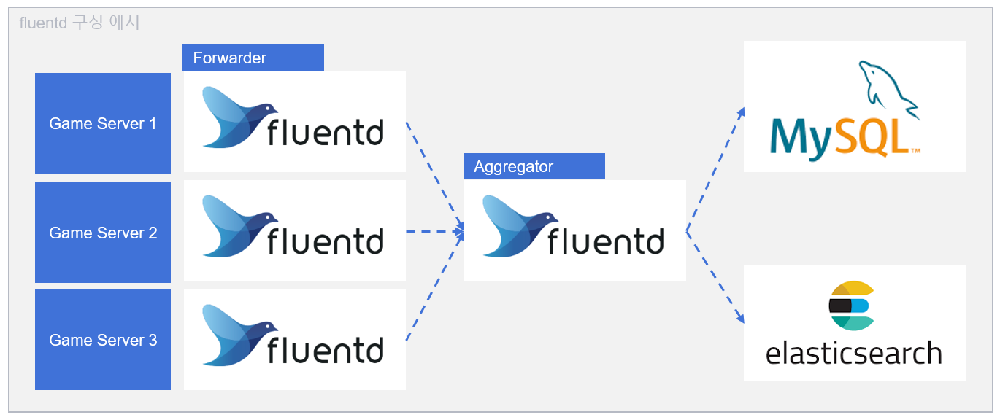
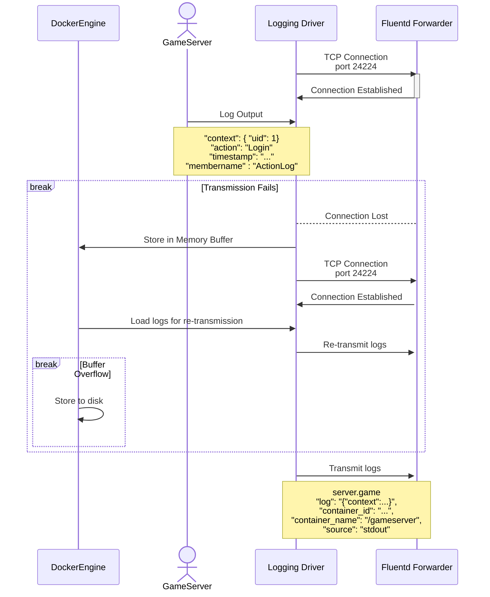
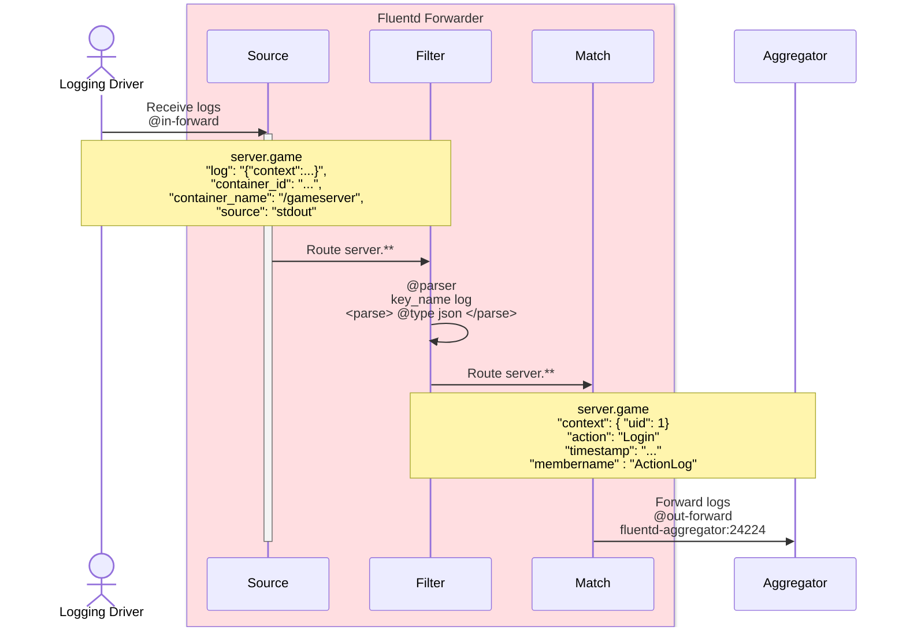
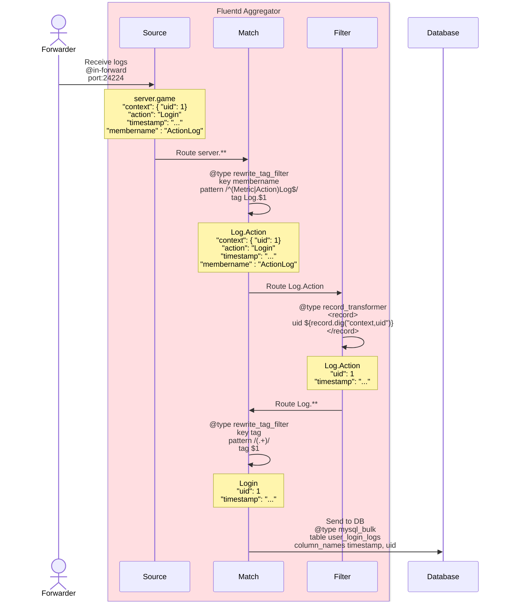

# Fluentd Logging Architecture


This project demonstrates a modular, scalable Fluentd logging setup for containerized environments, using a Forwarder–Aggregator architecture. It utilizes Docker’s built-in Fluentd logging driver, processes and routes application logs from containers to a central database (e.g., MySQL).

#### Content

- [Architecture Overview](#architecture-overview)
- [Plugin Overview](#plugin-overview)

#### Key Features

- Docker-native logging via the fluentd driver
- Forwarder container per service (no processing)
- Aggregator container for filtering, parsing, and DB storage
- Output logs stored in a structured schema using mysql_bulk
- Robust buffering with failure fallback

## Architecture Overview

```
[Docker Container Logs]
        ↓
  Docker Fluentd Driver
        ↓
    [Fluentd Forwarder]
        ↓
    [Fluentd Aggregator]
        ↓
      [MySQL DB]
```

This system uses:

- Fluentd Forwarder per service: only collects and routes logs
- Fluentd Aggregator: performs all parsing, filtering, tagging, and persistence



### Fluentd Logging Driver in Docker

With Docker, logs can be sent directly using the fluentd logging driver.
Following diagram illustrates how Docker's Fluentd logging driver interacts with a Fluentd Forwarder to transmit container logs.



- 1. Connection Establishment

  - Docker’s logging driver (D) tries to establish a TCP connection to the Fluentd Forwarder (F) on port 24224.
  - Once the connection is established, it's ready to transmit logs.

- 2. Log Output
  - The GameServer (GS) writes a log (e.g., via Console.WriteLine or standard output).
  - The logging driver captures this log and attempts to send it to Fluentd.

JSON-formatted log is tagged and forwarded with container metadata:

```json
{
  "context": { "uid": 1 },
  "action": "Login",
  "timestamp": "...",
  "membername": "ActionLog"
}
```

### Component Responsibilities

#### Forwarder

The Forwarder Acts as the log sink for Docker's Fluentd logging driver.

Its main role is to forward logs without transformation.



#### Aggregator

The Aggregator performs the following:

- Receives logs from the Forwarder.
- Applies filters and transformations if needed.
- Sends logs to a storage backend (e.g., MySQL).

To prevent data loss, the Aggregator should be deployed with persistent volumes (Kubernetes) or volume mounts (Docker).



## Plugin Overview

- [Input Plugin](#input-plugin)
  - [Forward](#forward)
  - [Tail](#tail)
- [Filter Plugin](#filter-plugin)
  - [Parser](#parser)
  - [Record Transformer](#record-transformer)
- [Output Plugin](#output-plugin)
  - [Rewrite Tag Filter](#rewrite-tag-filter)
  - [Forward](#forward)

### Input Plugin

Fluentd uses different input plugins depending on the log source.

#### Forward

Used to receive logs over TCP.

Example from Docker Logging Driver:

```apacheconf
<source>
  @type forward
  port 24224
  bind 0.0.0.0
</source>
```

- `port 24224`: Listening port.
- `bind 0.0.0.0`: Accept connections from all interfaces.

#### Tail

Used for tailing log files on host machines.

Example from Host System (Tail File):

```
<source>
  @type tail
  path /var/log/app.log
  pos_file /var/log/fluentd/app.pos
  tag app.log
  <parse>
    @type json
  </parse>
</source>
```

- `pos_file`: Keeps track of the last read position to avoid reprocessing.
- `tag`: Used to route logs downstream.
- `parse`: Defines log format (json, regexp, etc.).

### Filter Plugin

#### Parser

Parses log strings from the log key.

Raw logs like this are produced when using docker's built-in fluentd logging driver:

```
{
  "log": "{\"timestamp\":\"2024-10-02T08:29:50.7544882+00:00\",\"action\":\"Login\",\"context\":{\"uid\":1}}"
}
```

Since the forward input plugin doesn’t support inline parsing, use the parser filter like following:

```
<filter server.**>
  @type parser
  key_name log
  <parse>
    @type json
  </parse>
</filter>
```

This properly parses JSON to:

```json
{
  "context": { "uid": 1 },
  "action": "Login",
  "timestamp": "2024-10-02T08:29:50.7544882+00:00"
}
```

#### Record Transformer

Extracts or transforms log fields. Supports Ruby logic.

The record_transformer plugin modifies log entries:

```
<filter foo.bar>
  @type record_transformer
  <record>
    tag ${tag}
  </record>
</filter>

```

Transforms:

```json
{
  "message": "hello world!"
}
```

Into:

```json
{
  "message": "hello world!",
  "tag": "foo.bar"
}
```

Example using Ruby:

```
<filter foo.bar>
  @type record_transformer
  enable_ruby
  <record>
    avg ${record["total"] / record["count"]}
  </record>
</filter>
```

Result:

```json
{ "total": 100, "count": 10, "avg": "10" }
```

### Output Plugin

#### Rewrite Tag Filter

Rewrites tags based on log content.

```
<match server.**>
  @type rewrite_tag_filter
  <rule>
    key membername
    pattern /^(Metric|Action)Log$/
    tag Log.$1
  </rule>
</match>

```

To use this plugin, install plugin with:

```bash
fluent-gem install fluent-plugin-rewrite-tag-filter
```

#### Forward

Used to forward logs to an upstream Aggregator.

```
<match pattern>
  @type forward
  send_timeout 60s
  recover_wait 10s
  hard_timeout 60s

  <server>
    name myserver1
    host 192.168.1.3
    port 24224
    weight 60
  </server>
  <server>
    name myserver2
    host 192.168.1.4
    port 24224
    weight 60
  </server>

  <secondary>
    @type file
    path /var/log/fluent/forward-failed
  </secondary>
</match>
```

Load is distributed based on weight.
If one server fails, logs are automatically redirected to the other.

#### Stdout

Useful for debugging log flows.

```
<match **>
  @type stdout
</match>
```

#### Mysql Bulk

Writes logs to MySQL efficiently in batches.

```
<match Login>
  @type mysql_bulk
  database logdb
  username shanabunny
  password your_password
  table user_login_logs
  column_names timestamp, uid
  <buffer>
    @type file
    path /var/log/fluent/buf/login
    flush_interval 10s
    chunk_limit_size 2m
  </buffer>
  <secondary>
    @type file
    path /var/log/fluent/forward-failed
  </secondary>
</match>
```

### Deployment Recommendations

- Use file-based buffers in Aggregator to persist logs during restarts.

- Use separate Fluentd containers for Forwarder and Aggregator for modularity.

- Mount volumes for persistent buffer paths.

- Adjust chunk sizes and flush intervals based on expected log volume.

  - For Additional Reference: [Buffering parameters](https://docs.fluentd.org/configuration/buffer-section#buffering-parameters)

- Secure Forwarder-Aggregator channels for production use (e.g., with TLS).
